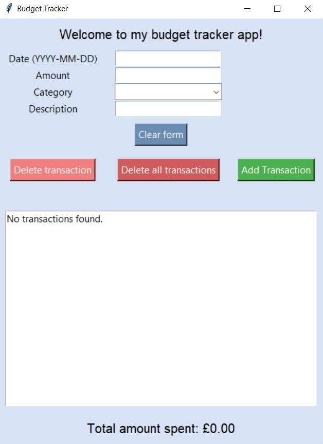

# 💰 Budget Tracker App

[](https://github.com/DylanFernandes98/budget-tracker/actions/workflows/ci.yml)
[](https://codecov.io/gh/dylanfernandes98/budget-tracker)


A simple personal finance tracker built with Python. This desktop app lets you record income and expenses, view transactions, and keep track of your budget in real time. It features a minimal interface built with Tkinter, uses SQLite for data storage, and includes both a dynamic bar chart to visualize spending by category and a prediction tool to estimate next month’s spending.

## 🖼️ Preview



## ✨ Features

- Add transactions with date, category, amount, and description  
- View all transactions in a scrollable interface
- Predict next month’s spending using basic linear regression
- Track current balance, monthly average, and predicted spend in real time
- Visualise spending per category with live-updating charts
- Store all data locally in `SQLite`  
- Interact with a clean, minimal `Tkinter` GUI

## 🛠 Tech Stack

- Python 3  
- `Tkinter` - User Interface  
- `SQLite` - Persistent Local Storage
- `Pandas` - Data Handling and Display
- `Matplotlib` – Graph Visualisation
- `Scikit-learn` – Machine Learning

## 🧪 Testing & CI

- Pytest – Unit Testing  
- Flake8 – Linting and Style Checks
- Mypy - Static Type Checking  
- GitHub Actions – Continuous Integration (CI)
- Codecov - Test Coverage Reports  

## 📚 Learning Outcomes

- Built a complete desktop app using Python, `Tkinter`, and `SQLite`  
- Used `Pandas` and `Matplotlib` to process and visualise financial data  
- Implemented linear regression with `Scikit-learn` to predict future spend
- Designed a user-friendly interface with real-time updates and interactive charts
- Packaged the app as a Python module with a clean `budget/` and `tests/` structure
- Created and managed a virtual environment with separate dependencies
- Added unit testing with Pytest, coverage reporting, static type checking with Mypy, and automated testing with GitHub Actions CI
- Achieved 100% test coverage on database logic and over 70% overall project coverage
- Added an option to export transactions as CSV for use in Excel/Sheets

## 🏗️ Project Architecture

- `budget/db.py` - SQLite database logic  
- `budget/ui/app.py` — Main Tkinter application class  
- `budget/ui/transactions.py` — Transactions tab logic (add/view/delete + chart)  
- `budget/ui/insights.py` — Insights tab logic (trend, pie chart, summary)   
- `budget/main.py` - Application entrypoint  
- `tests/` - Pytest unit tests 

## 🚀 How to Run

1. **Clone the repository**
   ```bash
   git clone https://github.com/DylanFernandes98/budget-tracker.git
   cd budget-tracker
2. **Create and activate a virtual environment**
- Windows (PowerShell)
   ```bash
   python -m venv venv
   .\venv\Scripts\activate
- Mac/Linux (bash/zsh)
   ```bash
   python3 -m venv venv
   source venv/bin/activate
3. **Install dependencies**
- Runtime only (end users)
   ```bash
   pip install -r requirements.txt
- Development (for testing and linting)
   ```bash
   pip install -r requirements.txt -r requirements-dev.txt
4. **Run the application**
   ```bash
   python -m budget.main
5. **Run tests**

   Tests are located in the `tests/` directory. Pytest will automatically discover and run them:  
   ```bash
   python -m pytest
