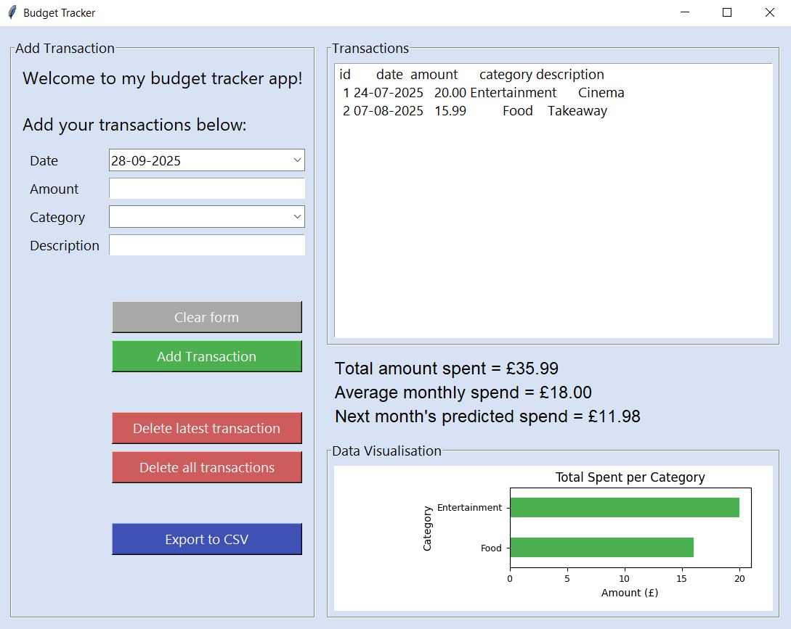

# 💰 Budget Tracker App

A simple personal finance tracker built with Python. This desktop app lets you record income and expenses, view transactions, and keep track of your budget in real time. It features a minimal interface built with Tkinter, uses SQLite for data storage, and includes both a dynamic bar chart to visualize spending by category and a prediction tool to estimate next month’s spending.

## 🖼️ Preview



## ✨ Features

- Add transaction expense with date, category, amount, and description  
- View all transactions in a scrollable interface
- Predict next month’s spending using basic linear regression on past data
- See the current balance, monthly average, and next month predicted spend update in real time
- Chart updates live when transactions are added or deleted
- Data is stored locally using SQLite  
- Built with a clean, minimal GUI using Tkinter
- Includes basic unit tests (Pytest) and CI workflow (GitHub Actions) for automated testing and linting

## 🛠 Tech Stack

- Python 3  
- Tkinter - User Interface  
- SQLite - Persistent Local Storage
- Pandas - Data Handling and Display
- NumPy - Numerical Operations
- Matplotlib – Graph Visualisation
- Scikit-learn – Machine Learning
- Pytest – Unit Testing  
- GitHub Actions – Continuous Integration


## 📚 Learning Outcomes

- Built a complete desktop app using Python, Tkinter, and SQLite  
- Used Pandas and Matplotlib to process and visualise financial data  
- Implemented linear regression with Scikit-learn to predict future spend  
- Practiced modular design, code readability, and GitHub-based version control with CI/testing
- Designed a user-friendly interface with real-time updates and interactive charts  

## 🚀 How to Run

1. **Clone the repository**
   ```bash
   git clone https://github.com/DylanFernandes98/budget-tracker.git
   cd budget-tracker
2. **Create and activate a virtual environment**
   ```bash
   python -m venv venv
   .\venv\Scripts\activate
3. **Install dependencies**
   ```bash
   pip install -r requirements.txt
   pip install -r requirements.txt -r requirements-dev.txt
4. **Run the application**
   ```bash
   python main.py
5. **Run tests**  
   ```bash
   pytest
